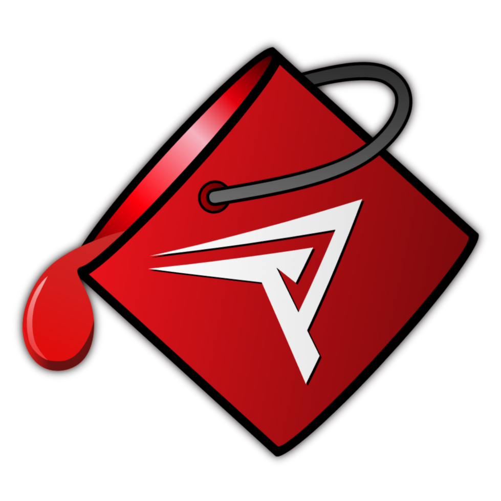
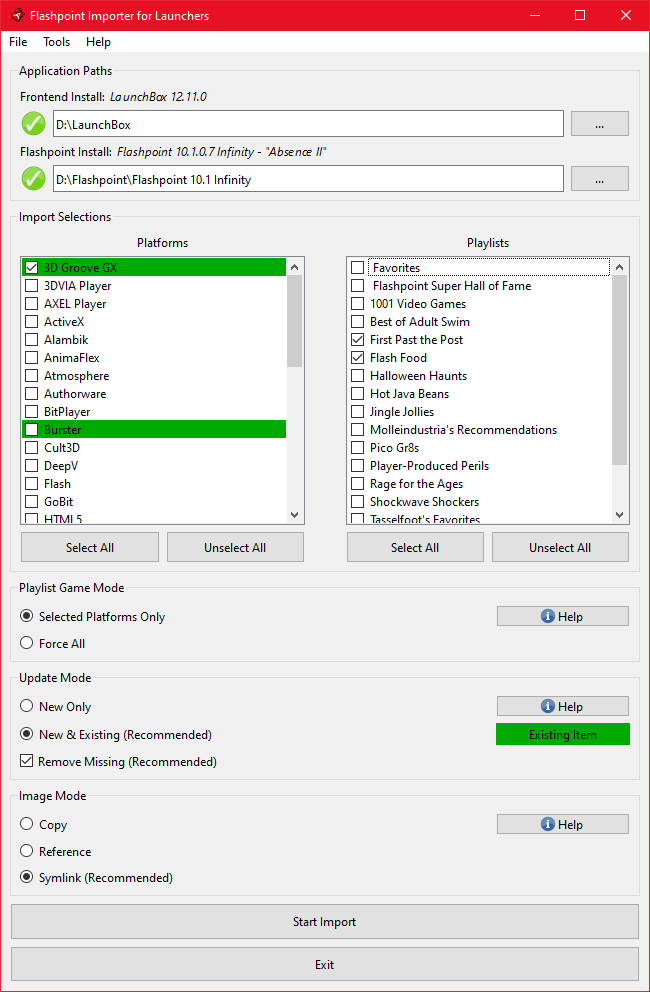

# FIL (Flashpoint Importer for Launchers)

FIL  is an importer tool for several launchers/frontends that allows one to add platforms and playlists from [Flashpoint Archive](https://flashpointarchive.org/) to their collection. It is fully automated and only requires the user to provide the paths to their launcher and Flashpoint installs, choose which Platforms/Playlists they wish to import, and select between a few import mode options. Once the import is started the current progress is displayed and any errors that occur are shown to the user, with resolvable errors including a prompt for what the user would like to do. After the process has completed, the specified launcher can be started and the games from Flashpoint can be played like those from any other Platform.

For Platforms, the importer is capable of importing each game/animation along with any additional apps, images, and most of the metadata fields (i.e. Title, Description, etc, see below).

Checkout **[Usage](#usage)** to get started.

## Function
This utility makes use of its sister project [CLIFp (Command-line Interface for Flashpoint)](https://github.com/oblivioncth/CLIFp) to allow launchers to actually start and exit the games correctly. It is automatically deployed into your Flashpoint installation (updated if necessary) at the end of a successful import and the latest version of CLIFp will be included in each release of this utility so it is not generally something the end-user needs to concern themselves with.

Before making any changes to your collection, any datafiles that will be altered are automatically backed up (only one backup is maintained at once so any previous backup will be overwritten) and if any unrecoverable errors occur during the import any partial changes are reverted and the backups are restored; however, **it is strongly suggested that  you consider making a manual backup of your launcher's configuration to be safe.** No responsibility is held for the loss of data due to use of this tool.

FIL can safely be used multiple times on the same collection to update the selected Platforms and Playlists if that have already been imported previously. The method with which to handle existing entries is selected within the program before each import.

The import time will vary, correlated with how many Platforms/Playlists you have selected, but more significantly the image mode you choose, which is expanded on later. Importing the entire collection usually takes 5-10 minutes with the recommended settings but can take longer with a more basic PC. The vast majority of the processing time is due to the plethora of images that have to be copied/symlinked when games processed so the speed of your storage device is the most significant factor. Running the importer for updates should be significantly faster it first checks to see if the source image from the new import source is actually different than your current one before copying/linking it.

You will still be able to use the standard Flashpoint launcher as normal after completing an import.

# Compatability

### Supported Launchers
 - [LaunchBox](https://www.launchbox-app.com/)
 - [AttractMode](http://attractmode.org/)
 - [ES-DE](https://es-de.org/)

### Flashpoint
While testing for 100% compatibility is infeasible given the size of Flashpoint, FIL was designed with full compatibility in mind.

The ":message:" feature of Flashpoint, commonly used to automatically show usage instructions for some games before they are started, is supported. The entries that use it are added as additional-apps to their respective games as they once were when Flashpoint came packaged with LaunchBox. All messages are displayed in a pop-up dialog via CLIFp.

Viewing extras (which are simply a folder) is also supported and the corresponding additional apps that open these folders will be added when importing a platform.

Each metadata field (i.e. Title, Author, etc.) is matched to the closest equivalent of a given launcher, or a custom field if there is no near equivalent and the launcher supports them; otherwise, the field will be omitted.

Both Flashpoint Ultimate and Flashpoint Infinity are supported.

### Version Matching
Each release of this application targets a specific version series of Flashpoint Archive, which are composed of a major and minor version number, and are designed to work with all Flashpoint updates within that series. For example, a FIL release that targets Flashpoint 10.1 is intended to be used with any version of flashpoint that fits the scheme `10.1.x.x`, such as `10.1`, `10.1.0.3`, `10.1.2`, etc, but **not** `10.2`.

Using a version of FIL that does not target the version of Flashpoint you wish to use it with is highly discouraged as some features may not work correctly or at all and in some cases the utility may fail to function entirely or even damage the Flashpoint install it is used with.

The title of each [release](github.com/oblivioncth/FIL/releases) will indicate which version of Flashpoint it targets.

## Launcher Specific Details
See [LAUNCHER](doc/LAUNCHER.md)

## Usage
Essentially, you just need to download and run the program, provide paths to both your Flashpoint and Launcher installs, select your options, and go.

For more details, see [USAGE](doc/USAGE.md)

## Other Features
 - The playlist import feature is "smart" in the sense that it won't include games that you aren't importing. So if you only want to import the Flash platform for example and a couple playlists, you wont have to worry about useless entries in the playlist that point to games from other platforms you didn't import. This of course does not apply if you are using the "Force All" playlist game mode.

## Limitations
 - Although general compatibility is quite high, compatibility with every single title cannot be assured. Issues with a title or group of titles will be fixed as they are discovered.
 - The "smart" feature of the Playlist import portion of the tool has the drawback that only games that were included in the same import will be considered for that playlist. If you previously imported a Platform and now want to import a Playlist that contains games from that Platform you must make sure you select it again for it to be updated/re-imported in order for those games to be added to that Playlist. Alternatively, you can use the "Force All" playlist game mode, but this will also possibly add new platforms you did not previously import.
- If you are using Infinity you will be able to play any game that is imported, even if it hasn't been played yet in Flashpoint; images for the games however will not be present until they've been seen/loaded in Flashpoint at least once and require the importer to be ran again afterwards, unless you use the "Force Download Images" option.

## Source

### Summary

 - C++23
 - CMake >= 3.24.0
 - Targets
    - Windows 10+
    - Ubuntu 20.04+

### Dependencies
- Qt6
- [Qx](https://github.com/oblivioncth/Qx/)
- [libfp](https://github.com/oblivioncth/libfp/)
- [CLIFp](https://github.com/oblivioncth/CLIFp)
- [Neargye's Magic Enum](https://github.com/Neargye/magic_enum)
- [OBCMake](https://github.com/oblivioncth/OBCmake)

### Details
The source for this project is managed by a sensible CMake configuration that allows for straightforward compilation and consumption of its target(s), either as a sub-project or as an imported package. All required dependencies except for Qt6 are automatically acquired via CMake's FetchContent mechanism.

### Building
See [COMPILING](doc/COMPILING.md)
