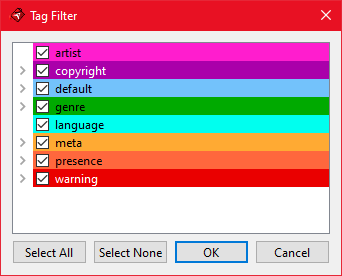

# Usage (Primary)

 **Before using FIL, be sure to have ran Flashpoint through its regular launcher at least once**

 1. Download and run the latest [release](https://github.com/oblivioncth/FIL/releases) (the static variant is recommended)
 2. Ensure Flashpoint and the launcher are both not running
 3. Manually specify or browse for the path to your launcher install, the utility will let you know if there are any problems. If everything is OK the icon next to the install path will change to a green check
 4. Manually specify or browse for the path to your Flashpoint install, the utility will let you know if there are any problems. If everything is OK the icon next to the install path will change to a green check
 5. The lists of available Platforms and Playlists will quickly load
 6. Select which Platforms and Playlists you want to import. Existing entries that are considered an update will be highlighted in green
 7. If importing Playlists, select a Playlist Game Mode. These are described with the nearby Help button in the program, but here is a basic overview of their differences:
	 - **Selected Platforms Only** - Only games that are present within the selected platforms will be included
	 - **Force All** - All games in the playlist will be included, importing portions of unselected platforms as required
 8. If any entries you have selected are for updates you may select update mode settings. These are described with the nearby Help button in the program, but here is a basic overview of their differences:
    - (Exclusive) **New Only** - Only adds new games
    - (Exclusive) **New & Existing** - Adds new games and updates the non-user specific metadata for games already in your collection
    - (Applies to either of the above) **Remove Missing** - Removes any games from your collection for the selected Platforms that are no longer in Flashpoint
 9. Select a method to handle game images. These are described with the nearby Help button in the program, but here is a basic overview of their differences:
    - **Copy** - Copies all relevant images from Flashpoint into your launcher install (slow import)
    - **Reference** - Changes your launcher install configuration to directly use the Flashpoint images in-place (slow image refresh)
    - **Symlink** - Creates a symbolic link to all relevant images from Flashpoint into your launcher install. Overall the best option

 10. Press the "Start Import" button

The symbolic link related options for handling images require the importer to be run as an administrator or for you to enable [Developer mode](https://www.howtogeek.com/292914/what-is-developer-mode-in-windows-10/#:~:text=How%20to%20Enable%20Developer%20Mode,be%20put%20into%20Developer%20Mode.) within Windows 10

**Example:**

# Usage (Tools)

## Tag Filter
The tag filter editor allows you to customize which titles will be imported based on their tags.

Tags are listed alphabetically, nested under their categories names so that you can select or unselect an entire category easily. Exclusions take precedence, so if a title features a single tag that you have unselected it will not be included in the import.

All tags are included by default.

## Image Downloading
Only available when using Flashpoint Infinity, the "Force Download Images" option will download the cover art and screenshot for each imported title if they have not yet been retrieved through normal use of Infinity.

**WARNING:** The Flashpoint Infinity client was only designed to download images gradually while scrolling through titles within its interface, and so the Flashpoint image server has bandwidth restrictions that severely limit the practicality of downloading a large number of images in bulk. Therefore, it is recommended to only use this feature when using Infinity to access a small subset of the Flashpoint collection, such as a specific playlist, or curated list of favorites. Otherwise, if having all game images available in your launcher is important to you, you should be using Ultimate, or be prepared to wait an **extremely** long time.

## Animations
Since most launchers are game oriented, animations are ignored by default. If you wish to include them you can do so by selecting the "Include Animations" option.

## CLIFp Distribution
This tool automatically handles installing/updating the command-line interface Flashpoint client as needed; however, if for whatever reason you deem it necessary/useful to manually insert a copy of FIL's bundled CLIFp version, you can do so using the "Deploy CLIFp" option.

# Usage (Other)
When using the tool with Flashpoint Ultimate, keeping games in their archive sets `GameData_x.zip` within `Data/ArchiveData` is supported, but the image sets must still be extracted, since no third party launch can be configured by an external tool (i.e. FIL) to load images in through such a special mechanism.